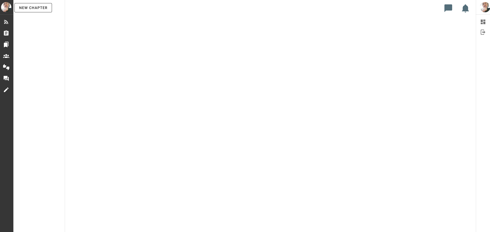
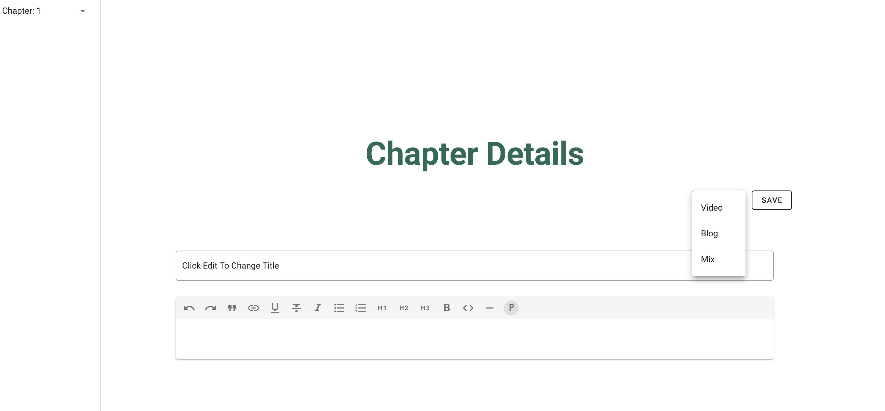
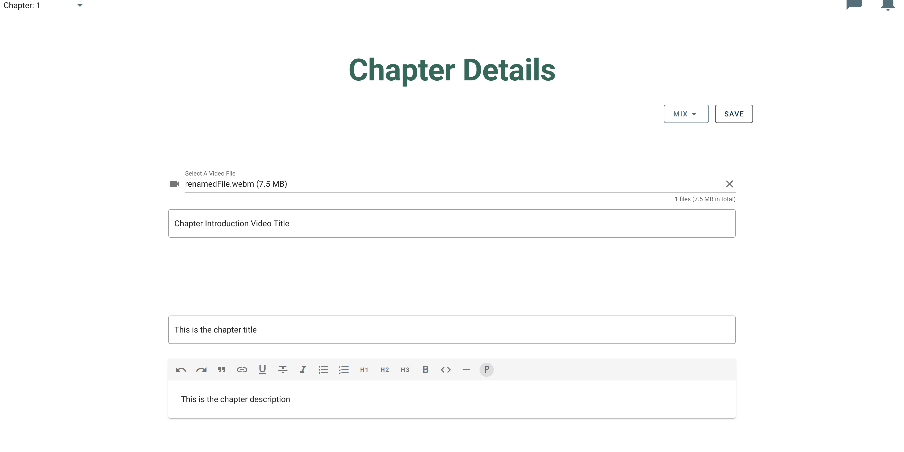

# Chapter

There are two possible ways to create a new chapter. The first is when creating the first chapter. In this scenario, you have an empty course shell, and a big beautify button that says "NEW CHAPTER". 

This is what that looks like.

The other way to create chapter is by clicking on the dropdown menu on an existing chapter and click "Add". This will add a new chapter right after the one you clicked on. 

This is what that looks like

## Adding Content

In the above screen click on the dropdown menu next the "SAVE" button and select your content type. The options are described below

  * Blog: Text and Images
  * Video: Video with a title
  * Mix: Both of the above

Once you've selected your content type, fill in the fields and upload a video if you selected "Mix" or "Video" for your content type. Then click save. Once you save you can navigate away

