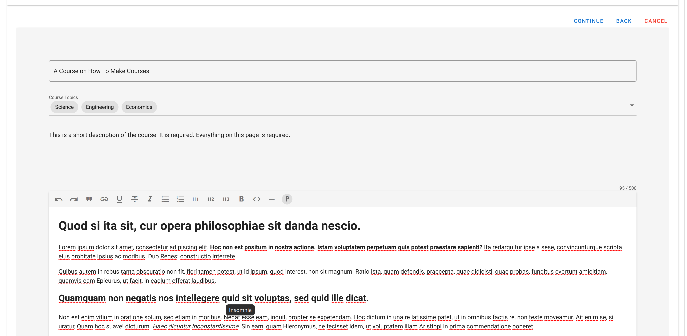

# Course

The course shell is made up of three importarnt parts: creator information, course media (welcome video and thumbnail) and course summary. To create a course, you will need to provide each of those three pieces.

But don't worry, the creator information is already in the system and will be autofilled. This leaves you with just the other two pieces which we will walk your through.

Roll Up Those Sleeves

## Open New Course Shell

From the home page, click on the big add (+) button.  

## Verify Info

Verify that all the information displayed is correct. If anything is wrong, go to your user profile and make the necessary changes. (This isn't possible as of now, just continue) 

Click continue

## Course Summary

Fill out the course summary information. Note that the short summary field is limited to 500 characters, the field following isn't limited. Once you fill out all the fields, click continue. If any field is missing, a pop up will inform you to finish this step before moving. Click ok and fill out all the missing fields then continue.

## Add Media

### Add Thumbnail

Upload an image and click continue. If you click continue without uploading an image, a popup will ask you to complete this step. 

### Add Welcome Video

Upload a video, and wait for video at least 30 seconds for video to upload. Once ready click continue. If the video hasn't completed uploading, or you haven't selected a video, a popup will once again ask you to complete this step before moving on. Once your screen looks like the screenshot below, you are ready to click Create Course

Once the course creates, you'll be taken to your new course and you are ready to begin creating content. 

### New Course

Once the course finishes creating, the new course opens. You now have a blank canvas for your to create a new world

