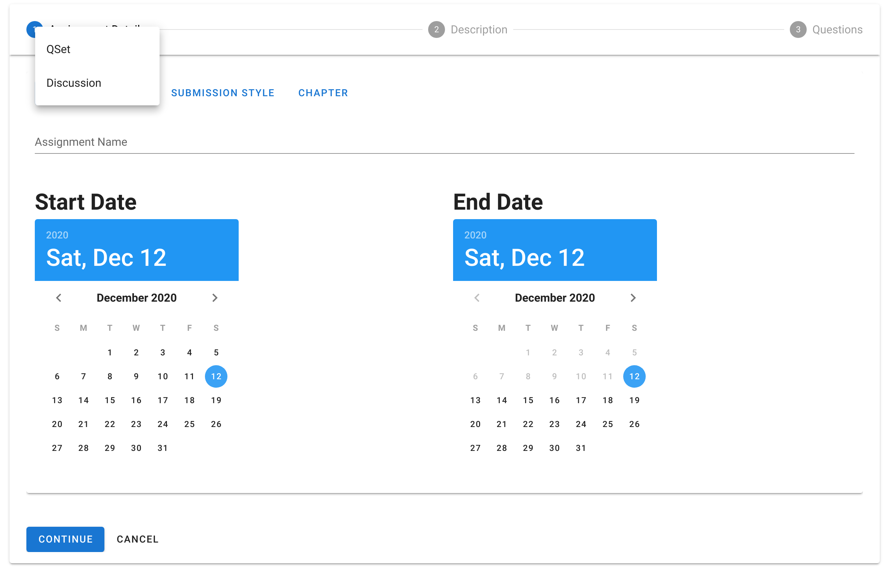
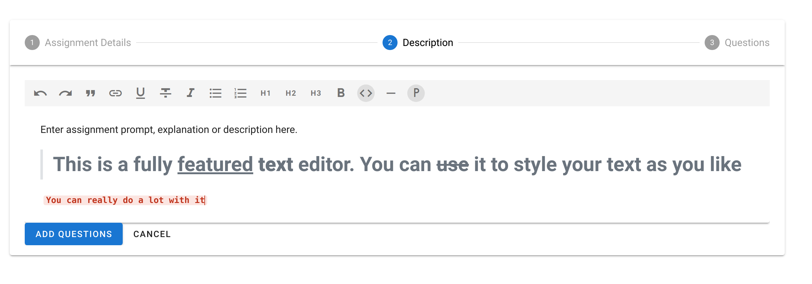
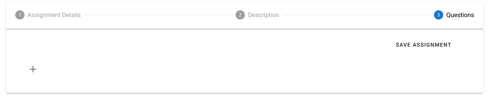
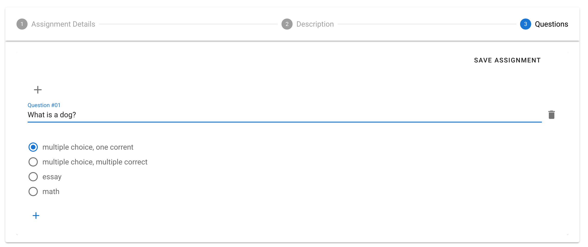
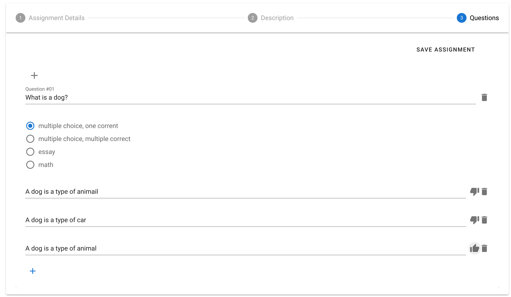
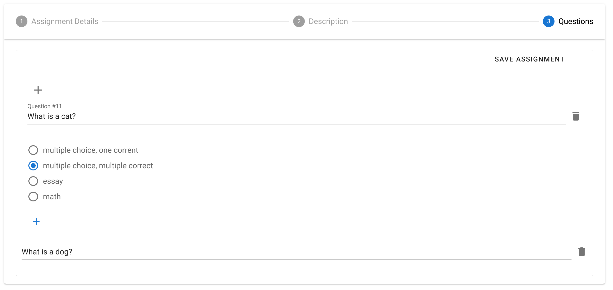
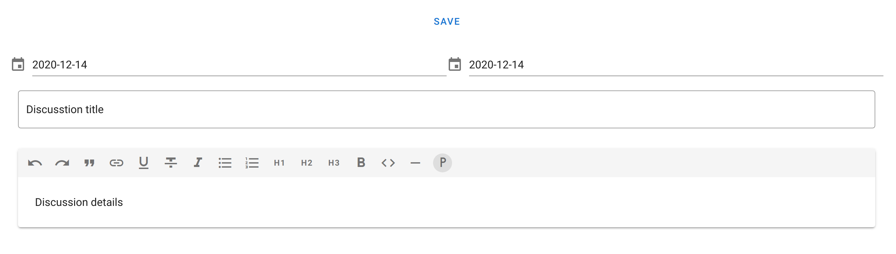

# Assignment

Before you begin here, make sure you read the assignments section in the Intro

Once you're ready to create an assignment, find the section you want and select "Add Assignment" from the dropdown menu of that section. 

Next, select the type of assignment you want to create from the Assignment Type dropdown menu

## QSet Assignments

### QSet Details
Once you selecct QSet, fill out the rest of the assignment details, then click Continue. 

### QSet Description
That should bring you to a screen that looks like the image below. Make sure you provide a description for your assignment using the text editor in that screen.

Once your done with your description, click Add Questions

### QSet Adding Questions

That should then bring you to your last screen. If you want to add questions, click the gray + button on the left side. Otherwise click "Save Assignment" on the right side to save assignment.

#### QSet Question Details

Once you click the + button to add a question, you will see a screen that looks like this. Here you will enter the question in the question field and then select the type of the question.

Once you select the question type, click the blue + button at the bottom to add the answer choices if you selected multiple choice.

Once you click the + button, enter the answer choices. Once you've added your answer choices, click on the thumb icon next to the question to mark the correct answer, or the trash icon to remove it.

Once you're done adding your first question, click on the gray + button at the top to add another question. After this, all the questions you've added should be displayed at the bottom. Once you're done, click save assignment.

## Discussion Assignments

To create a discussion assignment, select "Discussion" from the assignment type drowndown.

This will take you to a new screen. Enter the discussion details and click save.

