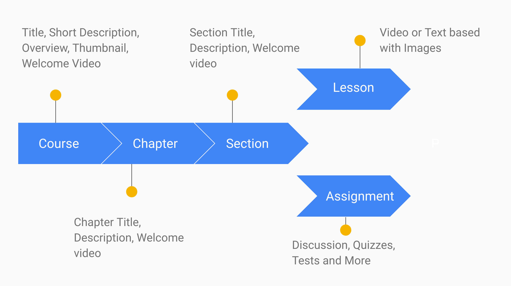

# Intro

Before you start creating content in Studio, it's important you understand it's the content hierarchy. In this page, we will explain the various learning content types and their compponent parts. We will not touch on how to create those content types here, instead we will provide an introduction that gives you a basic understanding of the content types and how they relate to each other. 

If you are looking for a how to create guide, click on the relevant section in the sidebar below creating content.

## Course 

The diagram below lays out the content hierarchy and by extension the "creation flow". I.e you will not be able to create a lesson before you create a section.

Notice:

  * Each level of the hierarchy is both video and text capable at the same time
  * You can opt for a full video course, or a mixed course
  * The assignment hierarchy contains a number of sub-components such as discussions and quizes

## Assignments

Of all the content types, assignments are the most complex. In the following sections we will break it down into it's component parts. Once you understand how assignments work, you can start creating assignments. 

### Assignment Types

Assignments can be either a discussion or a QSet.

#### Discussion Type

A discussion assignment is a forum prompt. The instructor poses a question and every student is required to respond. Students can then further respond to each other just as in a forum.

#### QSet Type

A QSet - short for question set - assignment is an assignment that poses a number of questions to a student. The instructor then determines the submission type of the assignment as: input, attachment or optional. 

### Submission Types

The submission type determines how the student responds to an assignment of QSet Type. The various types are discussed below.

#### Input Type

A submission of type input requires the user to directly enter their answers in assignment page. Each question in the assignment will have a user input field depending on the question type, which will be discussed in the next section.

### Question Types

Each question in a question set will have be have a type assigned to it. This type will determine how the student interacts with the question. Those types are listed below.

#### Multiple choice, one correct

This type of question is a multiple question with one correct answer.

#### Multiple choice, multiple correct

This type of question is a multiple type question with multiple correct answers. There isn't a limit to the number of correct answers here. All answers could be correct or just one could be correct. You decide.

#### Essay

An essay question will give the user a fully featured text editor where they can compose their resonse essay.

#### Math

A math question type will give the user an input field optimized for math to compose their answer.

## Resources

Resources are not included in the above diagram, but they fall under the course hierarchy. Meaning, once you create a course you can immidiately created resources. Resources can be created by both students and instructors. 

A resource can be a file directly uploaded to the course, or a link to an external resource such as a YouTube video or a new article

