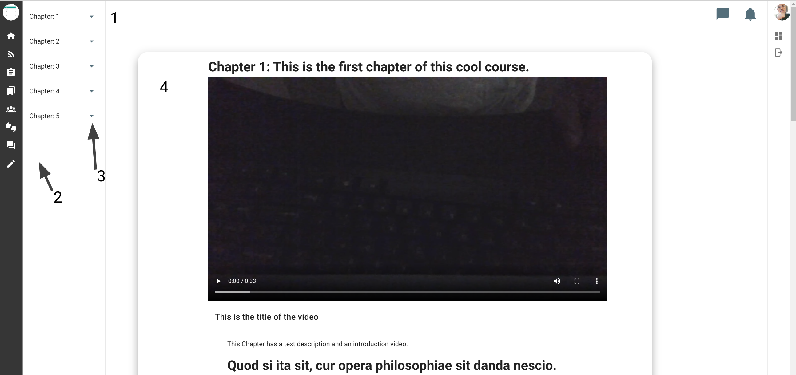
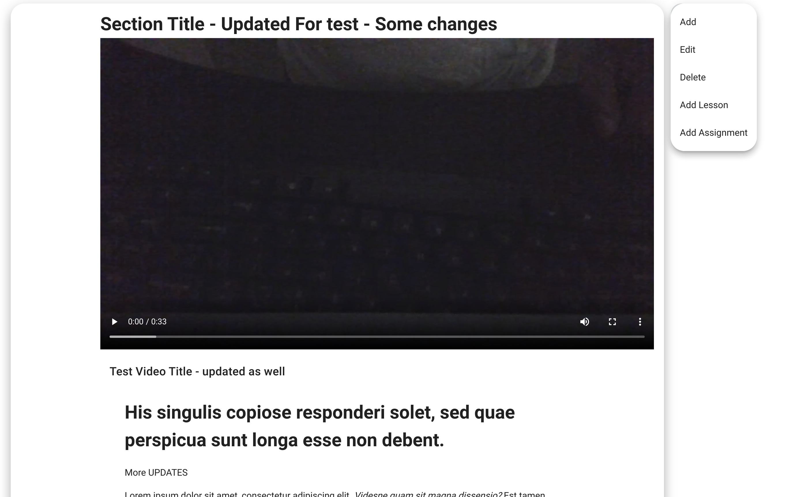
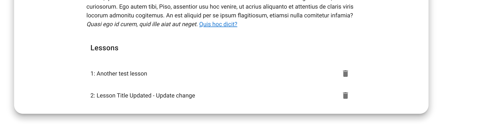
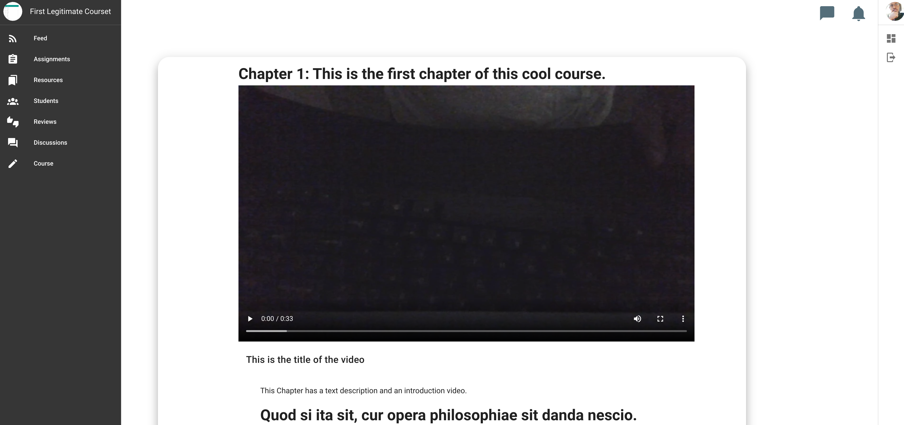
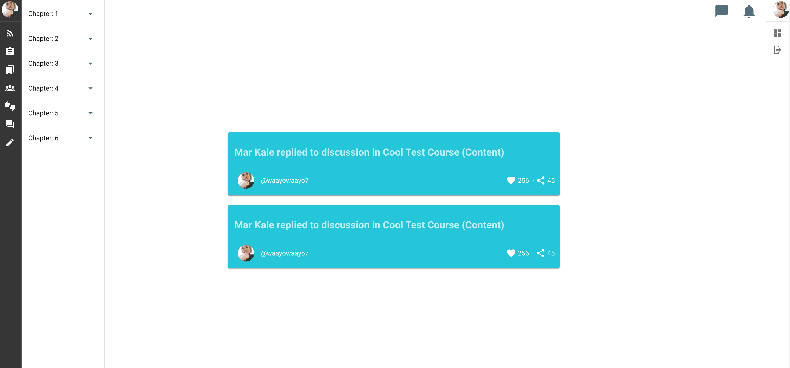
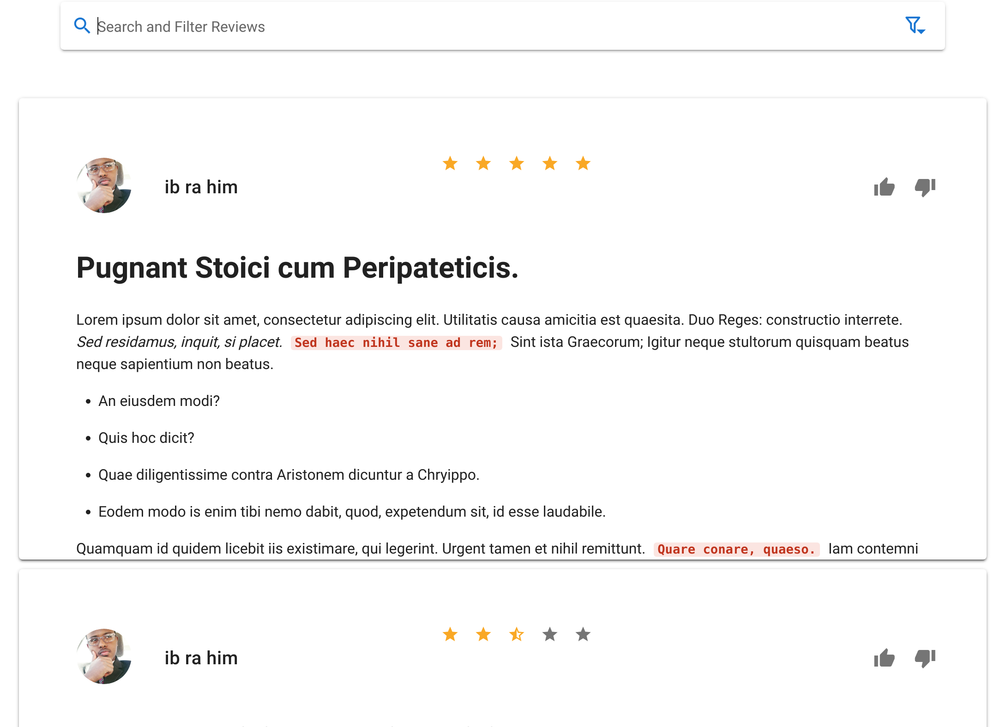
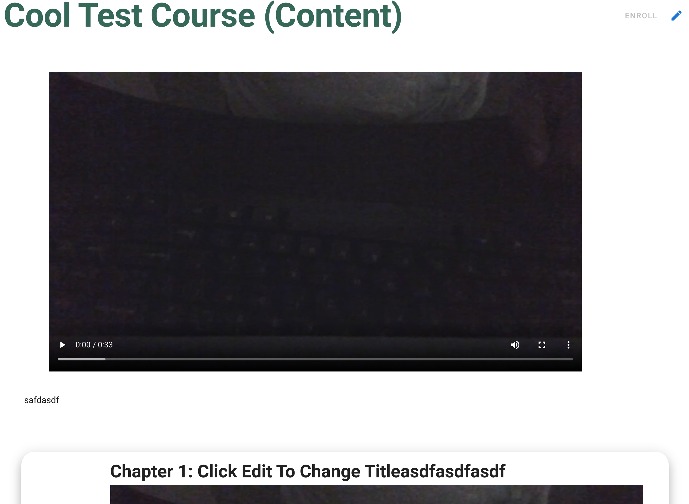

# Studio

Studio is where you teach and manage your course. It's the single most important piece of this platform. Learning to navigate it will save you time and make the experience much more enjoyable.

On the Studio homepage, you will find 4 important components. Two of them are on the left side, labeld 1 and 2 respectively. These are your Studio navigators. We will discuss these and the components below.

## Navigators

There are two Studio Navigators: the content navigator (#1) and the course navigator (#2)

### Content Navigator

The content navigator, labeled #1 allows navigation between the various chapters in your course content. It also allows you to manage your content through it's menu options button which is labeled #3. 

Clicking on a chapter will display all the sections in that chapter.

In turn, each section will also list all the lessons in it at the bottom

### Course Navigator

The course navigator, labeled #2 allows you to navigate your course. This is the dark stripe on the left side of your screen. By hovering over this navigator, it will expand show you the names of the various pages.

#### Home
Home is the first page listed and is your course home. The course homepage lists all the chapters in the course as seen in the following screenshot.

#### Feed

Feed, the next page in the list, is your central news page. All student activity in this course will be published here similar to most home pages on social media sites. Below is a screenshot. 

#### Assignments, Resources, and Students

Each of these pages provides a list of the relevant items as well as basic interaction capabilities.

#### Reviews 

The reviews page provides a list of the course's reviews and ratings, along with search and filtering capabilities. **Note that as of now, the search capability is functional**

#### Course 

The course page shows your course's landing (public) page along with an editing capability. It also lists course reviews at the bottom.

<!--  -->

