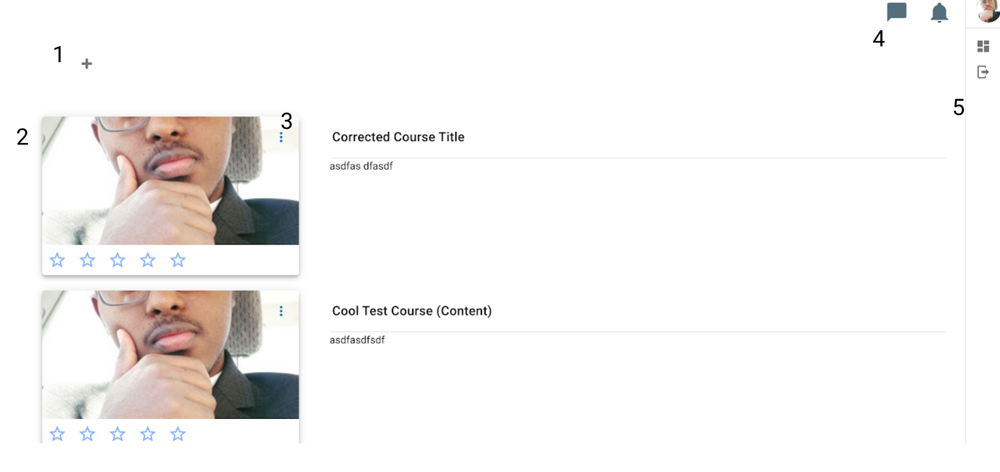
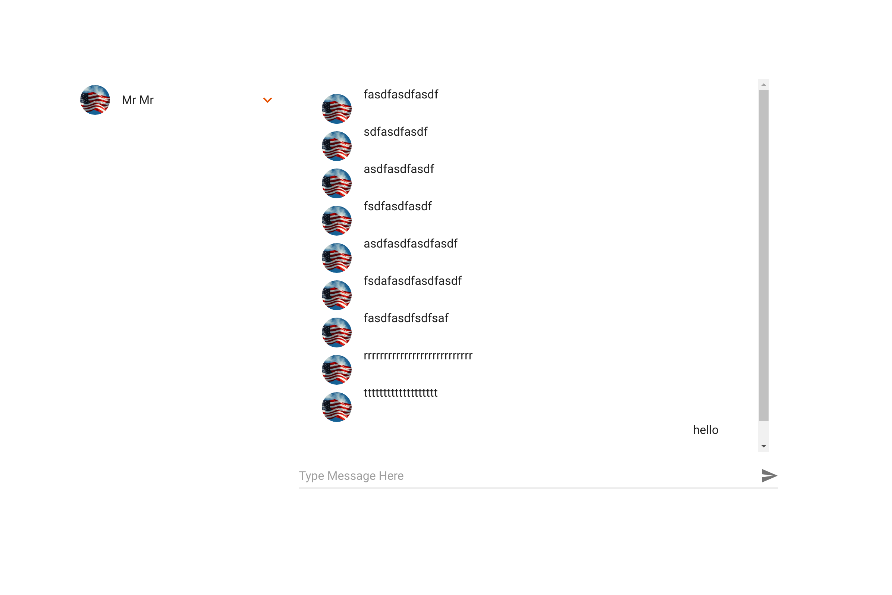
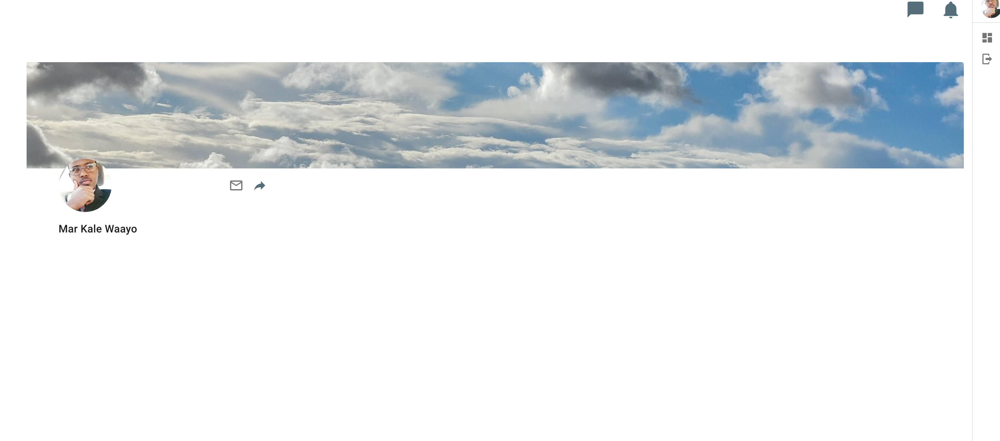

# Home

Your home page is all your courses are listed as well as where you go to a new course. There are four main components in the home page as listed in the following screenshot.

## New Course Button

**1**: At the center of the page, you'll fild a big + button. This is the button you click to create a course.

## Course list

**2**: Just below the button, you will find a list of your courses. For each course the thumbnail, title, summary, and rating is listed. Clicking on the title or the course thumbnail will open the course.

## Course Options Menu

**3**: On the top right hand corner of the course thumbnail, you will find a button. Clicking on this button will open a menu. This menu provides some quick actions including deleting the course, or open the course landing page

## Toolbar

**4**: At the top right corner of the homepage, you will find your main toolbar. It contains your notifications menu and your messages menu. When you get a notification, such as when a student submits an assignment you will see the number of unread notifications displayed next to the bell. If you then click on the bell, it will display a menu showing your notifications.

To the left of the notifications is your conversations button. This button will also show you a number representing all your unread messages. Clicking on this button will take you to your conversations page which is pictured below.

## Personal Navigation

**5**: On the right side of the homepage, you'll find your personal navigation drawer. The first item here is your avatar and name. Click on this will take you to your profile, which is very minimalistic for now. From your profile, which is pictured below, any user can send you a direct message or share your profile address. Below is a link to the home page, which you are on at the moment. You can use it when you are in the studio or on a different page. The last item on the list is a signout button which will signout out of the application.

