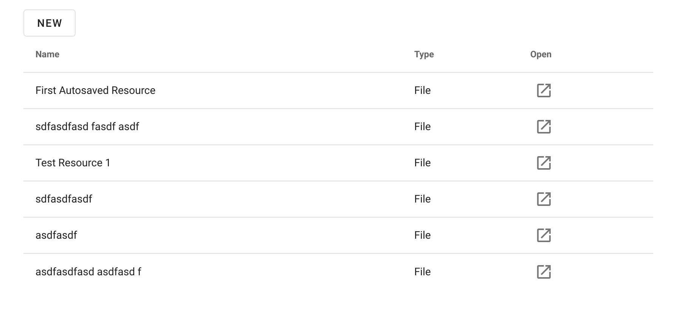
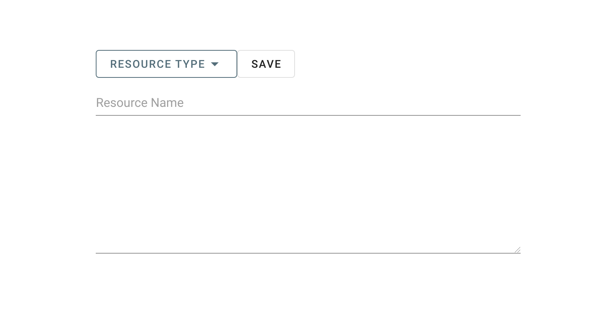
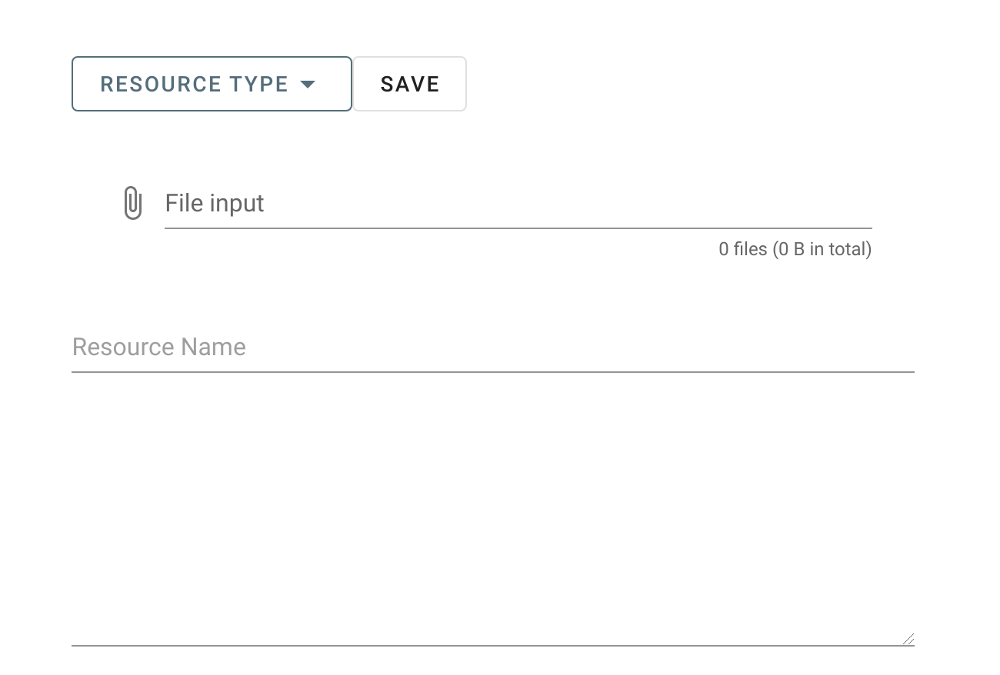
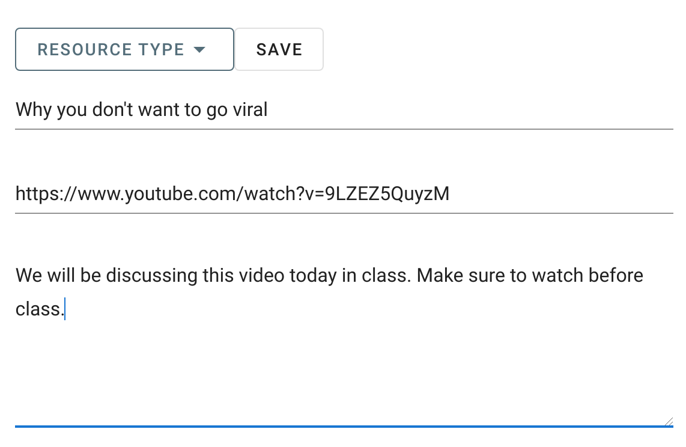

# Resources

To create a resource, go to the resources page and New at the top of the page.

That should bring to this page. On this page, click on the Resource Type dropdown menu and select the type of resource you want to create.

After selecting the resource type you see one of the following screens. Fill out the appropriately fill in the data, and the click save.

## File

This resouce will contain the file you uploaded and allow the user to download the file.

## Web Resource

This resouce will contain the link you provide.

