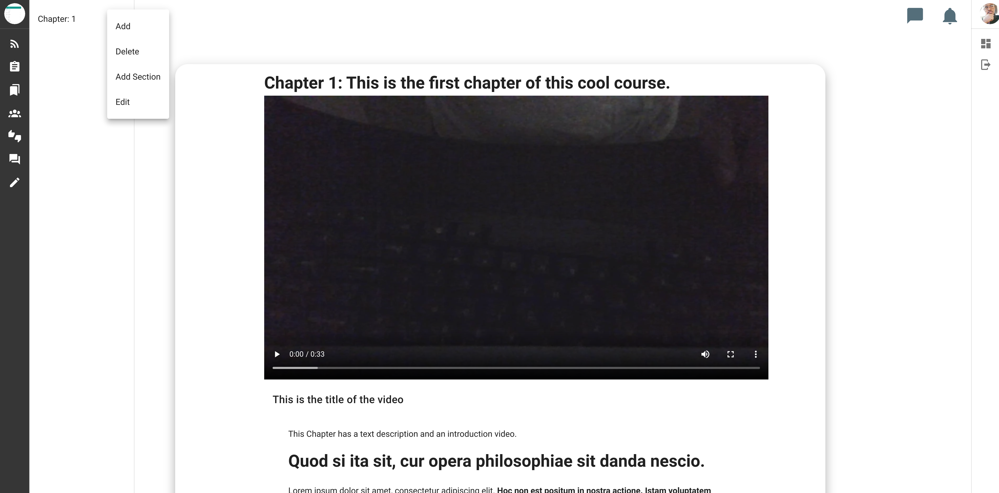
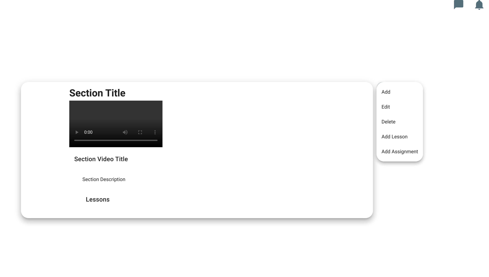

# Section

Like chapter, there are also two ways to create a section. One way is to click on a dropdown menu on a chapter and click "Add Section". This can be seen below.

Another way is click on the dropdown menu on a section and click "Add"

## Adding Content

At this point, you may reference the chapter section as this step is exactly identical to the same step in that section. 